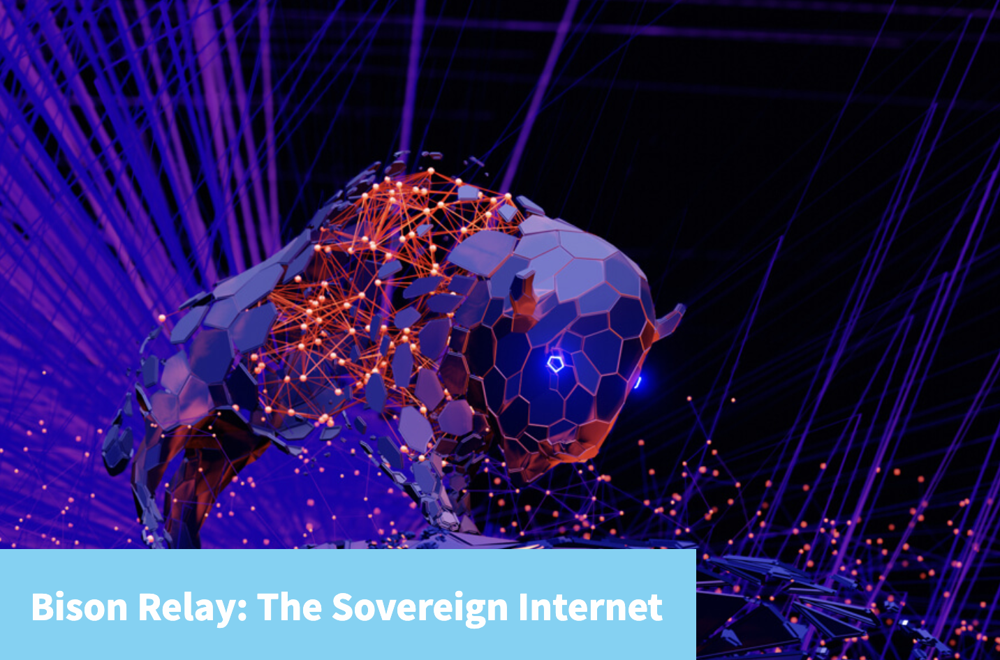

# Bison Relay: 主权互联网

来自 JAKE YOCOM-PIATT 

今天，我发布了一个新的基于 Decred 的通信工具，[Bison Relay](https://bisonrelay.org/)，它支持言论自由、自由链接，并且可以作为一个完全独立的网络替代堆栈。我在之前的文章中概述了[现如今网络的实质性问题](https://blog.decred.org/2022/12/09/Trapped-in-the-Web/). Bison Relay 是一种异步客户端-服务器协议，它大量使用 Decred 闪电网络（“LN”），其中发送的每条消息都经过加密、元数据最小化，并可以通过 LN 进行小额支付。Bison Relay 服务器是无账户的，每条消息都是单独处理的，在发送和接收之前都需要付费。Bison Relay 紧密集成了支付、消息传递和社交媒体，这个初始版本实现了类似于 Twitter/Facebook 的点对点功能，可以向订阅者发帖、订阅用户的帖子、转发帖子以及回复帖子和评论帖子。

在下面的概述中，将清晰的展示为什么言论自由需要这种基于微支付的架构。虽然 LN 有其自身的复杂性，但 Bison Relay 可以有效地取代上一篇文章中提到的 5 种协议和堆栈中的 4 种——DNS、HTTP、SMTP 和 TLS——其中现有的 Decred LN 和链上支付替代了法定支付基础设施。网络监控和审查的猖獗和侵略性表明网络迫切需要重新设计，而 Bison Relay 以基本对等加密内容中继网络的形式提供重新设计。使用非常少量的 Decred，例如 0.1 DCR，用户可以通过 Bison Relay 访问免费、主权和私人交流数月。

此初始版本适用于 Windows、MacOS 和 Linux 的图形用户界面（“GUI”）客户端和适用于大多数平台的命令行界面（“CLI”）客户端。

## 设计与论证

Bison Relay 是在假设有强大对手控制的基础设施主要组件的威胁模型下开发的，这是 Decred 主要功能的标准，例如权益证明治理、StakeShuffle 隐私或 DCRDEX 原子交换。指导 Bison Relay 架构的一个关键观察是服务器运营商对用户数据和元数据的保管被用来审查和监视用户，因此主要的方法是积极地减少服务器运营商对用户数据和元数据的可访问性和保管.

Bison Relay 的设计过程可以通过以下一系列观察清楚地描述：

- 假设服务器运营商是恶意的，并试图监视和审查客户。
- 根据许多其它聊天协议，默认情况下使用端到端加密（“E2EE”）来加密用户消息。这可以防止服务器操作员读取用户消息。
- 删除用户帐户的服务器概念，以最大限度地减少服务器操作员对元数据的跟踪。
- 将客户端消息元数据减少到最低限度。
- 如果服务器运营商无法将数据传输链接到特定客户端，它会阻止传统的恶意客户端禁令，从而产生拒绝服务（“DoS”）。
- 迭代垃圾信息接收方式，向所有用户收取每条发送和接收的消息的费用，费用是通过闪电网络支付的。
- 将服务器的复杂性降低到最低限度，其中服务器仅在接收发送的消息之前以及将消息转发给收件人之前检查是否已付款。
- 客户端通过带外（“OOB”）邀请或通过由他们共有的链接调解的邀请相互连接，例如，Alice 认识 Bob，Bob 认识 Carol，因此 Bob 将 Alice 介绍给 Carol。

构建 Bison Relay 大约花了 2 年时间，从 2020 年秋季开始，我提出了最初的概念，Marco Peereboom 和我完成了初始设计工作，Marco 完成了 CLI 客户端和服务器的所有早期开发。从有效的 CLI 概念验证到成品，包括所有 LN 支付集成、跨平台 GUI 和服务器后端重新设计，由 Miki Totefu、Dave Collins、David Hill 和 Alex Yocom 完成。Bison Relay 已经进行了几个月的私人 Beta 测试，只修复了一些bug并且其很稳定。

## 执行

Bison Relay 的动机和特点从上面应该已经比较清楚了，那么是时候从工程的角度来回顾一下这些主要特性是如何实现的了。

- Bison Relay was built using code from our existing secure communications tool, [zkc](https://github.com/companyzero/zkc/), where work began by removing the client and server notions of a client account. Correspondingly, Bison Relay has inherited [the various security features from zkc](https://blog.decred.org/2016/12/07/zkc-Secure-Communications/) like Double Ratchet message and header encryption, postquantum-secure Public Key Infrastructure, and a simple CLI client and server.
- To limit DoS attacks against the message send and receive paths on the server, each such action requires a preceding corresponding micropayment from the client to the server.
- A new peer-to-peer process for clients to connect to new peers was added, where ratchet initiation between peers is done either via OOB invite or mediated by 1 or more intermediate peers, rather than using a server.

## No accounts

Removing accounts from zkc was a bit tricky because of how zkc uses a Double Ratchet to encrypt and decrypt all messages. In zkc, as with most other chat protocols, the server routes messages from user A to user B, and any missed messages can lead to the ratchet state getting out of sync and needing to be reset. We decided to use the ratchet state as the basis for a unique per-message identifier, so the ratchet state, which is already shared between 2 peers, could be used as the basis for routing in addition to message encryption. To do this, we took the header encryption key from the Double Ratchet, which is not unique per message, and adjusted it to be unique per message using HMAC. By taking a unique per-message header encryption key and hashing it, we can derive a unique identifier for each message that both peers using a ratchet can track. This process was inspired by [Jonathan Logan’s coverage of dropgangs](https://pca.st/7xws4p19), where black market items are sold online using cryptocurrency and dropped in locations that are later disclosed to the buyers for retrieval.

## Embedded LN and paying per message

Once accounts are no longer linked to messages, clients uploading and downloading messages with the server must precede their actions with micropayments over LN. If this did not occur, malicious clients could run a DoS attack at a very low cost. Uploaded data is paid for by the byte and received messages are paid for by the message because in the first case disk space is the limited resource and in the second case the database load scales with message count. Sent messages are stored by the server for 30 days and then purged from its database (PostgreSQL), which may force ratchet resets for users who are offline for over 30 days at a time.

## P2P social networking

Typical social media or chat services have a database table of their users, so user A can request to be connected with user B and the server routes the messages. Since we have engineered out the server-based routing of messages and instead use client-based routing, clients must connect with each other without the use of a server “phonebook”, i.e. lookup table. Clients may connect either via OOB invite, which can be sent over other chat or relay networks, preferably via a secure channel, or via Bison Relay directly using mediated key exchanges. This mediated key exchange process would occur roughly as follows:

- Bob is in contact with Alice and Carol, but Alice and Carol are not in contact over Bison Relay.
- Bob posts something that both Alice and Carol can see.
- Alice makes a comment on the post.
- Carol sees Alice’s comment on the post.
- Carol decides to initiate a mediated key exchange to connect directly with Alice.
- Bob mediates the key exchange requested by Carol with Alice.
- Carol and Alice are connected directly.

A similar process can occur across several intermediate peers that exist in between the 2 peers that are attempting to connect. Mediated key exchanges avoid the need for an authoritative lookup table by reverting to the “old” meatspace model of meeting people, where you’re introduced to new people via people you already know.

Analogous to reposting on various existing social media platforms, clients can “relay” another client’s post to their own followers. If several clients relay a single post in a series, the scenario described above with several intermediate peers existing between 2 peers attempting to connect can occur.

## Implications

Bison Relay represents a major architectural shift in how communications platforms operate. There are both obvious and more subtle consequences of this architecture.

The obvious:

- The audience for credibly-neutral social media infrastructure may find Bison Relay an attractive option. There is no server operator or central planner who can arbitrarily turn off your account, unlike almost every other social media plaform. Clients are sovereign over their communications and networks.
- Using Bison Relay requires possessing a small amount of Decred, e.g. 0.1 DCR. This will generate demand for Decred across a wider audience that previously did not exist.
- Networks built on Bison Relay are surveillance- and censorship-resistant, reducing many issues originating from malicious advertiser, server operator, and government actions.
- An existing Bison Relay client can be used to onboard new clients via invites and sending small amounts of Decred on-chain to fund new clients’ channels. Users are onboarded by their friends and associates, tying telecommunications to users’ existing social networks.
- Bison Relay will drive growth and decentralization in Decred LN. Just like the internet started with a few nodes, LN hubs can be added in more locations to spread out the load.

The subtle:

- Unlike most tech corporations, we do not need hundreds of thousands or millions of users on Bison Relay for it to substantially magnify the value proposition for Decred. Bison Relay is built to grow via word of mouth. Just the prospect of a Signal-like system without the requirement of phone number metadata and a low cost is a draw.
- Most existing web infrastructure can be replicated on Bison Relay, e.g. pages, ecommerce, and paid subscriptions. This is a work-in-progress and there should be something to demonstrate in the next several weeks. Think bricks and mortar stores, Patreon, Substack, Soundcloud, and OnlyFans without the questionable platform fees and restrictions.
- Bison Relay has no authoritative naming system on purpose. As soon as there is a public directory, it is not possible to attribute spam to a source. By having no phonebook in Bison Relay, the path of spamming users and spam is always attributable.
- Decred has had difficulty obtaining substantive fiat exchange listings, so Bison Relay creates an informal way around this barrier by facilitating localized purchases of Decred, either via cash or other means.

It is difficult to capture all the various implications of Bison Relay, so feel free to communicate with us about it via [chat](https://chat.decred.org/) or other [communication channels](https://decred.org/community/).

## Conclusion

Bison Relay is a years-long effort of mine to use cryptocurrency to create a platform for free speech and free association. Back in 2017, I had idly wondered how this was possible, and 5 years later we have a working product with a nice user interface. The years since fall 2017 have been unpleasant as we soldiered forward through malicious miners manipulating our markets, persistent coordinated trolling campaigns, trade media blacklisting, and acute Twitter censorship. With the release of Bison Relay, Decred and any other individuals or groups that are being actively censored on other platforms can begin to build their own sovereign internet of content, ideas, and capital. Decred is money evolved and Bison Relay is internet evolved.

[Come join us on Bison Relay](https://bisonrelay.org/) and build your own sovereign internet. The revolution will not be custodial, censored, or surveilled.
