=Decred DEX=

这里是Decred Distributed Exchange (DEX)的'''DRAFT''' 规范性文档

__TOC__

==概述==

我们（decred）在这里提出一个去中心化的、非监管的、去信任的，无中介的加密货币交换（交易）系统。

去中心化交换（DEX）提供的主要服务是用户将一种数字资产交换为另一种。通过去信任的原子交换工具，促使各区块链资产能够安全进行交换。

提供定制的订单匹配逻辑以消除高频交易（HFT）算法及其它以机器人驱动的策略交易对于正常交易用户的剥削。消除单笔交易费（交易所常见0.2%）。

为了鼓励开放和主动开发，提供了关键协议组件的描述和完整的客户端 - 服务器API定义。

==介绍==

现有的加密货币交换平台（交易所）分为4个类别：托管公司实体类、服务类、token类和具有交换功能的中介链。绝大多数加密货币交易目前通过集中的监管交易进行。由于这些交易所的交易是在链外进行，因此它们通常会立即结算，以便为进一步交易提供资金。这是一个很好的功能，但它实际上使得交易市场将成为HFT和算法交易者的目标，这可能是不可预测和恶意的。此外，此类交易所通过收取交易费来赚取收入。这种模式为交易所创造了激励，通过洗牌交易人为地增加交易量&#91;1&#93;。据一项研究估计，超过95％的报告交换量是伪造的[https://www.sec.gov/comments/sr-nysearca-2019-01/srnysearca201901-5164833-183434.pdf &#91;2&#93;].

市面上已经出现的几个DEX项目是通过用区块链或代币映射作为方案，并且它们已经取得了不同程度的成功。当他们名义上删除受信任的第三方（TTP）时，他们会插入自己的产品作为捕获交易费用的手段，从而用新的平台费用代替TTP费用。收取交易费用的简单行为可以作为集中于特定解决方案的动机，这与开放式的交换系统背道而驰。虽然链或token用于移除TTP，但它也会产生订单匹配的挑战。

本文档中描述的DEX基于原子交换[https://github.com/decred/atomicswap &#91;3&#93;]，由客户签名和传输。因此，资金交换是去信任和安全的。DEX的目的是促进这种点对点交易，同时抑制操纵或滥用交易模式，并利用交易者和运营商难以进行的独立可验证的订单匹配算法。
虽然交易完全没有信任，但我们采取措施阻止恶意客户阻碍正常的交易活动。注册客户受[[#社区-行为|社区行为规则]]的约束，违反这些规则通常会导致失去交易特权。严重违规可能导致永久禁止，在这种情况下，受影响的用户必须支付另外的注册费才能继续使用DEX。

以下设计为此DEX构建的基础：

# 去中心。资产必须在用户之间直接交易并且提供撮合交易的服务器在任何情况下都无法控制资产。

# 无中介。交易以安全和去信任的方式执行。

# 抵制恶意交易和拒绝交易操纵。故意破坏性行为应被禁止，并且通过基于时间伪随机匹配逻辑来拒绝交易操纵。

本文档的其余部分详细介绍了关于DEX的设计。它是实现服务器和客户机时的第一个资源。保持在线的客户机-服务器互操作性可能取决于一些细节，尤其是以下关键部分。

'''[[#通信_协议|通信协议]]''' 描述了用于DEX API的消息传递协议和通信层技术。

'''[[#去中心化_交换_设计_基础|去中心化交换设计基础]]'''描述了促进具有上述特征的交换服务的显着设计方面。

'''[[#用户_订单_管理|用户订单管理]]'''详细说明了同步订单簿和下订单所需的不同订单类型和客户/服务器工作流程。

'''[[#原子_结算|原子结算]]'''通过几个示例介绍了结算过程，以提供高级概述。

'''[[#社区_行为|社区行为]]'''描述了与DEX交互的客户必须遵守的规则体系。

==通信协议==

===WebSockets===

去信任的交易撮合需要大量的信息。必须在适当的时间报告和转发交易详细信息，有时在后续操作之间会有很大的延迟。因此，通过HTTP轮询或其它基于请求间隔方法的匹配通知不适用于DEX系统。持久的全双工通信对于最小化通信延迟和浪费带宽至关重要。选择Websockets([https://tools.ietf.org/html/rfc6455 &#91;4&#93;])作为DEX交换API的默认和首选通信协议。除了满足上述需求之外，Websockets现在是一种成熟的技术，其客户端软件可用于几乎所有流行的编程语言的集成。

Websocket消息通过传输层安全性（TLS）[https://tools.ietf.org/html/rfc8446 &#91;5&#93;]连接上的加密来保护。

===JSON-RPC===

JavaScript Object Notation - Remote Procedure Call v2.0（JSON-RPC 2.0）是一种用于客户端 - 服务器通信的格式化消息协议[https://www.jsonrpc.org/specification &#91;6&#93;]。DEX API专门用于入站和出站客户端通信的JSON-RPC并且JSON-RPC的结构简单灵活。

<pre>
<nowiki>
{
	"method": "string",
	"id": int,
	"params": {} || [];
}
</nowiki>
</pre>

<pre>
{
	"result": {...} || null,
	"error": {...} || null,
	"id": int
}
</pre>

<code>method</code> 是被调用的“远程过程”，类似于调用函数。大多数参数都作为 <code>params</code> 对象或数组的一部分传递。参数将随方法而变化。该  <code>id</code> 字段链接对请求的响应，对于不需要响应的''notifications''是可选的 。

JSON-RPC 2.0指定在出现错误的情况下，响应的 <code>error</code> 字段将为非字段 <code>null</code> ，而 <code>result</code> 字段将为 <code>null</code> 。在成功的情况下，情况正好相反。

===HTTP===

可以为基本帐户管理和服务器状态查询提供使用HTTP进行消息传输的API，但是websocket连接是用于[[#放置、_监视和执行订单|放置、监视和执行订单]]的唯一手段 。限制HTTP API范围的主要原因是消除客户端轮询以快速更改资源，例如订单状态API端点。

==去中心化交换设计基础==

DEX设计的几个值得注意的方面被选择为允许对等交易，订单执行的机制完全存在于通过原子交换的单独区块链上。它们是：

* 特定于资产的订单数量增量和交易费率
* 基于纪元的伪随机顺序匹配
* 基于公钥基础结构（PKI）的客户端身份
* 用于集成任意资产的开放且严格定义的界面

本节介绍了这些设计方面。

===交换变量===

客户端必须知道许多特定于资产的变量。

资产的 '''lot size''' 同时作为最低订货量和限价订单和市场的买盘，，这是在市场的基础资产量化的订单数量增加。即在市场基础资产中量化。特别是，对于'''lot size''' 而言，要求的''order quantity''，'''''Q'''''必须满足

该地块面积为资产同时作为最低订货量和限价订单和市场的买盘，这是在市场的基础资产量化的订单数量增加。特别地，对于批量 升，所请求的订单数量， Q，必须满足特别是，对于“批量”而言，要求的“订单数量”，
“Q”必须满足

<!--Q = n l, n \in \{1, 2, 3, ...\}-->
[[File:spec/images/lot-sizes.png]]

当资产是报价资产时，会强制执行价格增量。限价单的'''rate'''、'''''r'''''必须是整数倍 价格增量，'''''p'''''。

<!--r = n p, n \in \{1, 2, 3, ...\}-->
[[File:spec/images/price-increment.png]]

DEX运算符指定在计算初始化事务的费用时使用的链上事务费率（单位原子/字节）。

每项资产都有两个不同的'''最低确认数'''。这 <code>fundconf</code> 是[[#支持_UTXO|支持UTXO]]所需的确认数量 。这 <code>swapconf</code> 是在广播第二次掉期交易之前第一次掉期交易结算期间所需的确认数量。

对于DEX监控交易中涉及的交易的变更输出，免除最小确认规则。

'''广播超时'''是客户端广播的事物。对于订单发起者，广播时间是从匹配通知的时间开始测量的。对于接受者，超时时间是从制造商的交换接收其的时间来测量 <code>swapconf</code> 的确认。

连接后，用户应立即请求资产信息。

'''JSON-RPC 方式:''' <code>assets</code>, '''originator:''' client

{|
! 领域     !! 类型 !! 描述
|-
| epochlen  || int   || the [[#Epochbased_Order_Matching|epoch duration]] (seconds)
|-
| buybuffer || float || the [[#Market_Buy_Orders|market buy buffer]]
|-
| cancelmax || float || the [[Rule_2_An_accounts_cancellation_ratio_must_remain_below_the_threshold|cancellation threshold]]
|-
| assets    || &#91;object&#93; || list of Asset objects (definition below)
|-
| btimeout  || int   || the broadcast timeout
|}

'''资产对象'''

{|
! 领域    !! 类型 !! 描述
|-
| symbol   || string || ticker symbol
|-
| lotsize  || int || lot size (atoms)
|-
| ratestep || int || the price rate increment (atoms)
|-
| feerate  || int || the fee rate for transactions (atoms/byte)
|-
| swapsize || int || the size of the initialization transaction (bytes)
|-
| swapconf || int || minimum confirmations for swap transactions
|-
| fundconf || int || minimum confirmations for backing UTXOs
|-
| scripts  || &#91;string&#93; || acceptable backing UTXO script types. minimum &#91;"P2PKH"&#93;
|}

===费用===

DEX不收取任何交易费用。从通过原子交换执行的交易中收取费用（服务器永远不能控制资金并且直接在链上进行结算）会增加交换过程的复杂性。在注册期间，交易池会收取一次性费用。注册费用可以阻止某些垃圾邮件攻击，在违反[[#社区_行为_规则|社区行为规则]]时启用惩罚性操作 ，并有助于支付DEX运营费用。注册费可由撮合交易服务器运营商配置。

====交易费用====

用户将以DEX运营商设定的低费率支付链上交易费用。未能在交易中提供指定的费率将导致违规行为。

作为任何提交订单的一部分，用户需要证明对支持原子交换的资金的控制，并确保支持资金足以创建交换合约交易以转移全部订单数量以及涵盖指定的费率网络交易费。

随着结算订单所需的掉期交易数量的增加，与订单相关的总链上费用将会增加。支付的最高费用[[#与_订单大小_呈线性关系|与订单大小呈线性关系]]，但实际支付的费用可能远低于最高费用。有关简单匹配和复杂匹配的示例以及它如何影响交换事务大小，请参阅[[#原子_结算|原子结算]]。

资产之间的费率差别很大。对于许多资产而言，可以在不增加开采时间的情况下收取低费用。随着资产推动链上扩展的限制，交易费用往往会上升。对于高费用资产，DEX运营商必须在较低的费用之间找到平衡，从会计的角度来看，这是较好的费用，而较高的费用可以通过提高交易的速度来减少结算时间。

另请参阅：[[#计算_交易费用|计算交易费用计算交易费用]]

===基于Epoch的订单匹配===

为了使某些高频交易算法所表现出的掠夺性行为贬值，接收的订单不是连续处理的，而是在一个洗牌步骤之后，在称为时期的固定持续时间内接收到所有其他订单。此算法的目标是确保单个客户端在执行交易时无法获得超过其他客户端的确定性延迟优势。限制这种可能性可以减轻从前端运行，欺骗和其他操纵交易实践中获得的优势。

====Epoch时间====

对于给定的epoch持续时间d> 0和当前的UNIX epoch时间标记 t（自1970年1月1日00:00:00 1970以来的秒数），当前订单匹配的epoch索引，i和epoch范围被计算为

<!--i = t / d, i d \leq t_i < d (i + 1)-->
[[File:spec/images/epoch-index.png]]

其中/是整数除法。例如，在写入时， t = 1562008475，其中对于d = 60，对应于时期数i = 26033474，跨越[1562008440,1562008500]。此约定允许在不查询服务器的情况下知道Epoch时间。

将使用诸如NTP的时钟同步协议来确保服务器和客户端时钟在可接受的容差内同步。

====伪随机顺序匹配====

当Epoch结束时，匹配周期开始。

首先，订单池被洗牌。混洗是确定的，使用Fisher-Yates算法，其中随机数生成器种子是从连接的订单[[#ID列|ID散列]]的散列中导出的 。具体地，对于散列函数f，种子散列， H seed被计算为

<!--H_{seed} = f(f(order_1) || f(order_2) || ... || f(order_N))-->
[[File:spec/images/seed-eq.png]]

其中，顺序i表示按字典顺序排序的订单ID和||列表中第 i 个订单的 订单ID 表示连接。

订单ID和最终哈希在匹配过程开始时发布。这样做是为了可以独立地计算混洗以进行外部验证并且便于服务器网格操作。

订单一次处理一个。每个订单根据其类型进行匹配。

1.如果订单是'''取消订单'''，则从列表中删除任何相应的常设限价订单，并且取消订单被视为已填写。如果在取消订单之前处理取消，则取消将失败，并且需要重新提交。也就是说，取消订单不会影响下行排序，只会影响常规订单。

2.如果订单是限价订单已经生效时间站立不能匹配立即('''一个制造商''')，它被添加到常规命令。它可以立即匹配队列中的订单。

3.如果订单是接受方，则将其与最佳可用常规订单进行匹配。通知两个订单的客户并开始结算过程。订单被留出来进行监控。如果现行的时限为了站在对本场比赛的两侧仅部分填充，它被添加到站立订单适当的修改，并可以立即再次匹配。

限制订单中任何有效时间的不匹配数量将立即生效。市场订单和即时限价订单无法匹配进一步排队的订单。

当限价订单与限价订单匹配时，将为匹配分配接受者订单的价格率。

该过程继续执行列表中的下一个订单并进行迭代，直到所有订单都已处理完毕。

===基于公钥基础设施（PKI）密钥对的身份===

使用公钥识别和验证服务器和客户端，使用匹配的私钥来签署和授权订单和其他消息。使用公钥建立客户端身份可以将客户身份的概念保持在最低限度，同时在整个订单放置和执行过程中提供许多其他安全优势。

从客户端提交给撮合交易服务器的所有数据必须使用客户端的私钥进行签名，并由服务器使用相应的公钥进行身份验证，因此直接使用客户端公钥进行身份验证是一种自然的简化，可以避免客户端用户名的需要和密码。

此外，由于Decred的链下治理平台Politeia也使用PKI，因此可以在两种服务上使用相同的身份，以便通过Politeia为交换数据添加时间戳。例如，给定DEX和Politeia之间的共同身份，在Decred区块链上锚定与DEX客户端和服务器行为相关的数据可能对建立信用系统很有用。

===区块链交互===

'''用户'''需要支持原子交换的钱包以及向[[#交换_中|交换]]涉及的每个区块链网络广播交易的能力 。

'''DEX运营商'''需要访问受支持的每个区块链项目的可信完整节点。虽然通过代理区块链数据服务（例如块浏览器）进行操作是可行的，但这会带来很大的安全风险。初始开发需要直接连接到每个区块链项目的完整节点。

通过实现特定的[https://golang.org/ Go]接口来添加对资产的支持 。导出和编译接口-buildmode=plugin以启用交换运营商的动态导入。操作员将决定通过配置文件导入哪些插件。由于预期的接口在初始实现期间会发生很大变化，因此接口结构的细节将在稍后发布。

除了将在DEX开发的初始阶段实施的Decred和Bitcoin之外，预计其它开发社区将发布它们自己经过适当审查的插件。

==帐户创建==

帐户由客户端的公共帐户密钥（pubkey）唯一标识，客户端在注册期间提供该密钥。注册后，客户端不直接用自己的pubkey标识自己。相反，帐户由'''帐户ID标识'''，帐户ID是客户端pubkey的双SHA-256哈希值， '''''<code>sha256(sha256(公钥))</code>'''''在JSON-RPC调用中作为十六进制编码字符串提供。

===步骤 1: 注册===

用户创建websocket连接并发送其[[#公共_密钥|公共帐户密钥]]。邮件使用相应的私人帐户密钥签名。响应包括服务器的公钥。服务器的公钥也将预先发布以进一步验证。

'''JSON-RPC 方式:''' <code>register</code>, '''发起人: '''用户

{|
! 领域     !! 类型   !! 描述
|-
| pubkey    || string || hex-encoded public account key
|-
| timestamp || int    || UTC timestamp
|-
| sig       || string || hex-encoded signature of serialized registration. serialization described below
|}

'''注册序列化'''

{|
! 领域     !! 大小 (bytes) !! 描述
|-
| pubkey    || 32 || the user's public account key
|-
| timestamp || 8  || the client's UNIX timestamp
|}

'''响应参数'''

{|
! 领域     !! 类型   !! 描述
|-
| pubkey    || string || hex-encoded server public key.
|-
| address   || string || fee address
|-
| fee       || int    || fee (atoms)
|-
| timestamp || int    || UNIX timestamp
|-
| sig       || string || hex-encoded signature of the serialized response. serialization described below
|}

'''响应序列化'''

{|
! 领域      !! 大小 (bytes) !! 描述
|-
| DEX pubkey || 32 || the server's public key
|-
| client pubkey || 32 || the client's public account  key
|-
| timestamp  || 8  || the server's UNIX timestamp
|-
| fee        || 8  || registration fee (atoms)
|-
| address    || varies || ASCII-encoded fee address
|}

===步骤2: 费用通知===

客户支付链上费用并通知DEX交易细节。使用标准P2PKH输出向步骤1中收到的地址支付费用。服务器立即发送收据，然后关闭连接。

'''JSON-RPC 方式:''' <code>notifyfee</code>, '''发起人: ''' 客户端

{|
! 领域     !! 类型   !! 描述
|-
| accountid || string || client's account ID
|-
| txid      || string || transaction ID
|-
| vout      || int    || the transaction output index which pays the fee
|-
| timestamp || int    || UNIX timestamp
|-
| sig       || string || hex-encoded signature of serialized fee notification. serialization described below
|}

'''通知序列化'''

{|
! 领域      !! 大小 (bytes) !! 描述
|-
| account ID || 16 || client account ID
|-
| tx ID      || 32 || the transaction ID
|-
| vout       || 4  || transaction output index
|}

'''响应参数s'''

{|
! 领域     !! 类型   !! 描述
|-
| sig       || string || server hex-encoded signature of client's serialized notification
|}

===步骤3: 等待确认===

一旦交易被发现并具有[[#必要数量_的确认|必要数量的确]]，[[#Session_Authentication|客户端应该创建新的经过身份验证的连接]]。如果客户端在swapconf确认之前尝试连接，则DEX应该完全拒绝连接。

==客户订单管理==

本节介绍客户端下订单所需的步骤，以及客户端和服务器之间的交互，以便在找到匹配项后执行订单。有关结算过程的高级概述，请参阅[[#原子-结算|原子结算]]部分。

有三种可用的订单类型。

* [[#限价_订单|限价订单]]用于以不高于（买入）或低于（卖出）的价格买入或卖出特定数量的资产，而不是指定价格。
* [[#市价_订单|市价订单]]用于以可用的最佳价格买入或卖出指定数量的资产
* [[#取消_订单|取消订单]]用于从订单簿中删除常规限价订单。

该订单持有现行时间只有限价订单的地位还没有完全填满或被取消。所有其他订单仅对一个[[#Epochbased_Order_Matching|eepoch匹配周期]]有效 。

===会话身份验证===

订单必须放在经过身份验证的连接上。建立websocket连接后，客户端将提供其帐户ID和签名。

'''JSON-RPC 方式:''' <code>connect</code>, '''发起方: ''' 客户端

{|
! 领域      !! 类型   !! 描述
|-
| accountid || string || account ID
|-
| apiver    || int    || requested API version
|-
| timestamp || int    || UNIX timestamp
|-
| sig       || string || hex-encoded signature of serialized connection data. serialization described below
|}

'''连接序列化'''

{|
! 领域   !! 大小 (bytes) !! 描述
|-
| account ID || 16 || client [[#Step_1_Registration|account ID]]
|-
| API version || 2 || requested API version
|-
| timestamp || 8  || the client's UNIX timestamp
|}

'''连接响应'''

如果客户在交易暂停后不久就连接，那么交易可能会在未来的时代开始。DEX响应将指示交易何时或将开始。

如果客户意外断开与活动订单的连接，订单可能会在客户缺席时匹配。响应中包含任何待处理匹配的列表。

{|
! 领域      !! 类型   !! 描述
|-
| startepoch || int   || the epoch at which trading did or will commence. May be in the future e.g. [[#Trade_Suspension|after maintenance]]
|-
| matches    || &#91;object&#93; || list of [[#Match_notifications|Match objects]]
|}

===连接持久性===

如果在下订单后连接丢失，客户必须重新连接并完成在他们缺席时进行的任何比赛的结算。无论连接状态如何，一旦匹配，客户端将始终通过广播超时违反规则1。无论连接状态如何，都是如此。

如果客户端在完整的纪元持续时间内断开连接，则服务器可以自动取消任何常规限制订单。这些取消将计入客户的 取消比率，因此可能会导致处罚。客户应仔细管理其订单，以确保不会发生这种情况。

立即生效的市价订单和限价订单在断开连接时不会被取消。提交后，这些订单将始终经历一个匹配周期。

如果客户端在连接断开时处于结算阶段，则客户端将重新连接并完成结算。

===订单订阅===

订阅市场可以查看和跟踪订单。

'''JSON-RPC 方式:''' <code>orderbook</code>, '''发起人: ''' 用户

{|
! 领域 !! 类型   !! 描述
|-
| base  || string || currency code for the market's base asset
|-
| quote || string || currency code for the market's quote asset
|}

回复将包含完整的市场订单。订单和所有更新都包含一个'''序列ID'''，每当DEX接受，删除或修改订单时，它会递增+1。客户负责跟踪序列ID以确保收到所有订单更新。如果缺少更新，客户应重新订阅市场以从头开始同步订单。

'''响应'''

{|
! 领域      !! 类型   !! 描述
|-
| book  || object || An OrderBook object
|-
| seq   || int    || A sequence ID
|}

'''JSON OrderBook 对象'''

{|
! 领域    !! 类型 !! 描述
|-
| marketid || int || the market ID. included with order book updates.
|-
| epoch    || int  || the current epoch
|-
| orders   || &#91;object&#93; || A list of Order objects
|}

'''JSON Order 对象'''

{|
! 领域   !! 类型  !! 描述
|-
| oid     || string || the order ID
|-
| otype   || string || "l" for ''limit'', "m" for ''market''
|-
| side    || string || "b" for ''buy'', "s" for ''sell''
|-
| osize   || int    || order size (atoms)
|-
| rate    || int    || price rate (quote asset per unit base asset, atoms). only set on limit orders
|-
| tif     || string || time in force. one of "i" for ''immediate'' or "s" for ''standing''. only set on limit orders
|-
| epoch   || int    || the epoch in which the order was received
|}

'''订单的更改'''将作为更新流从DEX收到。这些更新采用JSON-RPC通知格式，因此省略 <code>id</code> 属性。

'''JSON-RPC 方式:''' <code>remove_order</code>, '''发起人: ''' DEX

{|
! 领域   !! 类型 !! 描述
|-
| marketid || int || the market ID
|-
| orderid || string || hex-encoded order ID
|-
| seq   || int    || A sequence ID
|}

'''JSON-RPC方式:''' <code>add_limit</code> & <code>add_market</code>, '''发起人: ''' DEX

{|
! 领域  !! 类型!! 描述
|-
| marketid || int || the market ID
|-
| order  || object || the Order object
|-
| seq    || int    || A sequence ID
|}

在匹配周期的开始，DEX将发布订单ID列表和用于[[#Pseudorandom_Order_Matching|订单排序]]的种子哈希 。

'''JSON-RPC method:''' <code>match_data</code>, '''发起人: ''' DEX

{|
! 领域    !! 类型 !! 描述
|-
| marketid || int || the market ID
|-
| epoch    || int || the epoch for which the cycle occurs
|-
| orderids || &#91;string&#93; || list of order IDs for the epoch
|-
| seed     || string || hex-encoded sorting key
|}

客户可以在不关闭websocket连接的情况下'''取消订阅''' 订单簿更新。

'''JSON-RPC方式:''' <code>unsub_orderbook</code>, '''发起人: ''' 用户

{|
! 领域  !! 类型 !! 描述
|-
| marketid || int || the market ID
|}

===订单准备===

作为订单的一部分，客户必须证明对资金的控制。这是通过为将要花费的每个先前输出（UTXO）提供信息和签名来实现的。客户承担与投入自己的UTXO的投入相关的支持费用。

此外，客户端必须显示能够支付将生成的任何初始化事务的基本费用。客户必须证明他们有资金支付最坏情况下的所有费用，这是整个订单的单批匹配。在实践中，大订单很少会支付基本费用的总额，因为许多交易将超过单一交易的量。

====计算交易费用====

该'''费用'''支付与制作初始化交易在为了每场比赛相关的交易费用。

资产ž，一个基本费用比，[R ž是基于所计算出的批量大小，升（单位Ž），一个收费率， [R （Z /字节），和一个事务大小，小号（字节）。 s是基于具有1个标准P2PKH输入，1个标准P2PKH输出和1个交换输出的初始化事务预先计算的。

<!--R_z = \frac{ s r }{ l }-->
[[File:spec/images/fee_max_ratio.png]]

基本费用比率是一个常数，直到DEX操作者改变它的因素之一。

碱的费用，˚F 碱（单位Ž）可由下式计算ř Ž和订单数量，Q。

<!--f_{base} = Q R_z-->
[[File:spec/images/base_fees.png]]

基础费用与订单大小成线性比例，但基部费用的实际实现的部分，˚F 翅片，只能已知落入的范围内RS≤˚F 鳍 ≤˚F 基 。

客户还承担与支持UTXO，f utxo相关的支持费用。客户必须知道如何计算脚本大小以评估费用。在接受订单之前，DEX将验证UTXO总和。

====UTXO准备====

所有支持UTXO必须具有最少数量的确认。确切的数字 <code>swapconf</code> 是由DEX运算符设置的。

除了下面详述的市场买单，对于数量Q的订单，所选UTXO的总和值V必须满足关系

<!--V \ge Q + f_{base} + f_{utxo}-->
[[File:spec/images/utxo-sum.png]]

可能存在未实现的pubkey脚本类型。通常，P2PKH将始终可用。

作为订单的一部分，客户端将提交UTXO对象列表。

'''JSON UTXO对象'''

{|
! 领域     !! 类型   !! 描述
|-
| txid      || string || hex-encoded transaction ID
|-
| vout      || int    || the transaction output index
|-
| pubkey    || string || hex-encoded public key
|-
| sig       || string || hex-encoded signature of serialized UTXO data. serialization described below
|-
| extradata || string || hex-encoded data. the script for P2SH. empty for P2PKH
|}

这 <code>sig</code> 是根据下表序列化的UTXO数据的签名。数据使用对应的私钥签名 <code>公钥</code>。在 <code>公钥<</code> 必须散列在UTXO的PUBKEY脚本接收地址。

'''UTXO序列化'''

{|
! 领域   !! 大小 (bytes) !! 描述
|-
| tx hash || 32 || the transaction hash
|-
| vout    || 4  || the UTXO's transaction output index
|}

====订单签名====

所有订单必须由客户端和服务器签名。基本签名过程将涉及按照可在服务器上复制的特定过程将订单数据序列化为字节数组。然后使用客户端的私人帐户密钥对序列化数据进行签名 。

所有序列化结构的所有整数编码都是大字节存储次序。

所有订单序列化都具有共同的''前缀结构''。

'''前缀序列化'''
{|
! 领域      !! 大小 (bytes)   !! 描述
|-
| account ID  || 16 || client account ID
|-
| base asset  || 5  || the base asset for the market. ASCII-encoded ticker symbol, with leading zeros for 3- and 4-letter tickers
|-
| quote asset || 5  || the quote asset for the market. ASCII-encoded ticker symbol, with leading zeros for 3- and 4-letter tickers
|-
| order type  || 1  || the type of order. limit = 0, market=2, cancel=3
|-
| client time || 8  || the client's UNIX timestamp
|-
| server time || 8  || the server's UNIX timestamp. zeros for client-size serialization
|}

====订单ID====

订单序列化用于创建唯一的订单ID。ID定义为序列化订单的SHA-256哈希。它在消息传递中表示为十六进制编码的字符串。

===限价订单===

限价订单用于资产交易，其价格不高于指定价格（买入）或低于（卖出）。客户机可以指定在力的时间限价订单的作为一个：（a） 站立，这仍然在书籍直到填充或取消，或（b） 直接，其可以完全或部分地填充的完成执行。因此，直接期权适用于价格跨越价差的限价单（即接受者而不是制造商）。 <code>订单大小</code>  必须是资产的整数倍 lot size。

'''JSON-RPC方式:''' <code>limit</code>, '''发起人:''' 用户

{|
! 领域       !! 类型   !! 描述
|-
| accountid   || string || client's account ID
|-
| timestamp   || int    || UTC timestamp generated at the time of order submission of trades requires a fair amount of messaging between the 2 clients, via the DEX trade API.
|-
| tradepair   || string || market. trading pair. e.g. DCR/BTC
|-
| ordertype   || string || "limit" for a limit order
|-
| side        || string || one of "buy" or "sell"
|-
| ordersize   || int    || order size (atoms)
|-
| rate        || int    || price rate (quote asset per unit base asset, atoms)
|-
| timeinforce || string || one of ''standing'' or ''immediate''
|-
| utxos       ||  &#91;[[#UTXO_Preparation|UTXO]]&#93; || list of backing UTXOs
|-
| orderid     || string || hex-encoded order ID
|-
| sig         || string || client hex-encoded signature of the serialized order data. serialization described below
|-
| address     || string || address where the matched client will send funds
|}

'''响应参数'''

{|
! 领域    !! 类型   !! 描述
|-
| sig       || string || server hex-encoded signature of the serialized order, after adding the DEX timestamp
|-
| server time || int  || the server's UNIX timestamp
|}

'''限价订单序列化'''

{|
! 领域      !! 大小 (bytes)  !! 描述
|-
| prefix     || 65 || [[#utxo-preparation|the order prefix]]
|-
| UTXO count || 1  || The number of backing UTXOs
|-
| UTXO data  || 36 x count || [[#utxo-preparation|sequence of UTXO data]]
|-
| side       || 1 || 0 for buy, 1 for sell
|-
| rate       || 8 || price rate
|-
| quantity   || 8 || quanity to buy or sell (atoms)
|-
| time in force || 1 || 0 for ''standing'', 1 for ''immediate''
|-
| address   || varies || client's receiving address
|}

===市价订单===

市价单是以最佳市场价格买入或卖出资产的订单。JSON-RPC params字段类似于限制顺序，但没有rate字段。

市场订单无法取消。请求数量的任何不立即匹配的部分（在时期匹配周期期间）将保持未填充状态。

'''JSON-RPC方式:''' <code>market</code>, '''发起人: ''' 用户

{|
! 领域     !! 类型   !! 描述
|-
| accountid || string || client's account ID
|-
| timestamp || int    || UTC timestamp. order broadcast time
|-
| tradepair || string || market. trading pair. e.g. DCR/BTC
|-
| ordertype || string || "market" for a market order
|-
| side      || string || one of "buy" or "sell"
|-
| ordersize || int    || order size, in atoms (*1e8). See notes on market buy orders below.
|-
| utxos     || &#91;[[#UTXO_Preparation|UTXO]]&#93; || list of backing UTXOs
|-
| orderid   || string || hex-encoded order ID
|-
| sig       || string || client hex-encoded signature of the serialized order data. serialization described below
|-
| address   || string || address where the matched client will send funds
|}

'''响应参数'''

{|
! 领域     !! 类型   !! 描述
|-
| sig       || string || server hex-encoded signature of the order by server, after adding the DEX timestamp
|-
| server time || int  || the server's UNIX timestamp
|}

'''市价订单序列化'''

{|
! 领域      !! 大小 (bytes)  !! 描述
|-
| prefix     || 65 || [[#UTXO_Preparation|the order prefix]]
|-
| UTXO count || 1  || The number of backing UTXOs
|-
| UTXO data  || 36 x count || [[#utxo-preparation|sequence of UTXO data]]
|-
| side      || 1 || 0 for buy, 1 for sell
|-
| quantity   || 8 || quantity to buy or sell (atoms)
|-
| time in force || 1 || 0 for ''standing'', 1 for ''immediate''
|-
| address    || varies || client's receiving address
|}

====市价买单====

市场买单与市场卖单或限价单的规则略有不同。首先， <code>订单大小</code>  不是以基础资产计价，而是以报价资产计价。例如，在DCR / BTC市场上，DCR是基础资产，市场卖单和两种类型的限价订单 <code>订单大小</code>  都在基础资产DCR中量化，但市场买单 <code>订单大小</code>  是在BTC中。该订单基本上是“使用这么多BTC购买尽可能多的DCR”的声明。

在 <code>订单大小</code>  还没有绑定到其他类型的订单的积分批量大小的限制。

由于市场可能在订单匹配之前移动，因此在提交时不确定将会有多少批次匹配。对于接近1手的订单，可能不会发生匹配，因为在订单匹配时它不能承受单个批次。DEX服务器保持对确保只接受可匹配的有效订单的兴趣，因此必须小心处理市场买单以确保它们保持有效。

为防止订单因价格上涨而变得无效（太小而无法匹配），DEX运营商选择市场买入缓冲区，b m > 1。对于大量的大小市场升，且有一个最有名的站立沽盘价率，[R的ordersize， Q必须满足的关系Q> b 米 LR。如果在订单匹配之前最优惠利率增加，只要价格不超过~ b m r，订单仍将导致填充。如果市场买入缓冲区设置得太低或者市场特别不稳定且价格超过bm r，已被接受但现在太小而无法匹配的订单被视为已执行但尚未填写且帐户的取消统计数据没有变化 。

===取消订单===

取消订单从订单簿中删除常规限价订单。客户端无法取消市场秩序或有效的时限为了 眼前。此外，由于基于纪元的伪随机匹配处理，在与其相应的限制顺序相同的时期中提交的取消订单在其取消的订单之前有50％的机会被处理，从而导致错误。这是设计上的，并且不鼓励某些类型的欺骗。

'''JSON-RPC方式:''' <code>cancel</code>, '''发起人:''' 用户

{|
! 领域     !! 类型   !! 描述
|-
| accountid || string || client's account ID
|-
| timestamp || int    || UTC timestamp. order broadcast time
|-
| tradepair || string || market. trading pair. e.g. DCR/BTC
|-
| orderid   || string || hex-encoded order ID
|-
| sig       || string || client hex-encoded signature of the serialized order data. serialization described below
|}

'''响应参数'''

{|
! 领域    !! 类型   !! 描述
|-
| sig       || string || server hex-encoded signature of the serialize order data, after adding the DEX timestamp
|-
| server time || int  || the server's UNIX timestamp
|}

'''取消订单序列化'''

{|
! 领域      !! size (bytes)  !! 描述
|-
| prefix     || 65 || [[#utxo-preparation|the order prefix]]
|-
| orderid    || 16 || the order ID
|}

===匹配通知===

如果客户的订单在匹配周期结束时有一个或多个匹配项，则DEX将发送Match'''对象列表''。

'''JSON-RPC方式:''' <code>match</code>, '''发起人:''' DEX

{|
! 领域    !! 类型   !! 描述
|-
| orderid   || string || order ID
|-
| matchid   || int    || the match ID to use for progress notifications
|-
| quantity  || int    || the matched amount, in atoms of the base asset
|-
| rate      || int    || the rate that the order matched at (as quote asset per unit base asset, atoms)
|-
| address   || string || the client's receiving address
|-
| timestamp || int    || UTC timestamp. order broadcast time
|-
| sig       || string || server hex-encoded signature of the serialized notification data. serialization described below
|}

客户端将负责序列化通知和检查签名。反过来，客户端应该自己签署通知数据并向DEX返回确认。

'''用户确认'''

客户端将返回已签名的匹配确认列表。

{|
! 领域     !! 类型   !! 描述
|-
| matchid   ||  int  || the match ID
|-
| sig       ||  string || client hex-encoded signature of the serialized notification data.
|}

'''匹配通知序列化'''

{|
! 领域      !! 大小 (bytes)  !! 描述
|-
| orderid    || 32 || the order ID
|-
| matchid    || 8  || the ID assigned to this match
|-
| quantity   || 8  || the matched amount, in atoms of the base asset
|-
| rate       || 8  || the rate that the order matched at
|-
| address    || varies || ASCII encoded receiving address for the match
|}

===进度通知===

在客户端广播其初始化和兑换事务之后，他们应该将事务详细信息报告给服务器以进行验证并转发给对方。

'''JSON-RPC方式:''' <code>progress</code>, '''发起人:''' 客户端

{|
! 领域     !! 类型   !! 描述
|-
| swap stage || string || one of "init" or "redeem"
|-
| matchid    || int    || the matchid, retrieved from the [[#Match_notifications|match notification]]
|-
| txid       || string || the hex-encoded transaction ID
|-
| vout       || int    || the output index
|-
| timestamp  || int    || UTC timestamp. order broadcast time
|-
| sig        || string || client signature of the serialized progress notification. serialization described below
|}

'''DEX确认'''

{|
! 领域     !! 类型   !! 描述
|-
| matchid    ||  int  || the match ID
|-
| swap stage || string || one of "init" or "redeem"
|-
| sig        ||  string || client hex-encoded signature of the serialized progress notification. serialization described below
|}

'''进度通知序列化'''

{|
! 领域      !! 大小 (bytes)  !! 描述
|-
| orderid    || 16 || the order ID
|-
| matchid    || 8  || the ID assigned to this match
|-
| swap stage || 1  || 0 for initialization transaction, 1 for redemption
|-
| tx hash    || 32  || the transaction hash
|-
| vout       || 4 || the output index
|-
| timestamp || 8  || the client's UNIX timestamp
|}

===匹配撤销===

如果客户端无法在广播超时内执行操作，则服务器可以撤消匹配 。比赛撤销将导致对违规方的处罚。撤销的匹配数量不会以任何形式添加回订单簿。

'''JSON-RPC方式:''' <code>revoke_match</code>, '''发起人:''' DEX

{|
! 领域    !! 类型   !! 描述
|-
| orderid  || string || order ID
|-
| matchid  ||  int  || the match ID
|-
| sig      || string || server hex-encoded signature of serialized revocation. serialization described below
|}

'''撤销序列化'''

{|
! 领域      !! 大小 (bytes)  !! 描述
|-
| orderid    || 32  || the order ID
|-
| matchid    || 8  || the ID assigned to this match
|}

==交易暂停==

在许多情况下，服务器可以有意或无意地暂停操作。在交易暂停期间，不一定要撤销常设限价令。

如果服务器故意暂停操作，他们应该尽早向连接的客户端提供通知，理想情况是客户在匹配停止之前获得订单的几个时期。暂停通知中指定的纪元是第一个不再接受订单的纪元。用户应该在暂停期间失去联系。如果可能，服务器应在关闭连接之前解决所有现有匹配。如果无法做到这一点，客户端将需要在服务器重新联机时重新连接并完成结算。

如果服务器在没有通知的情况下断开连接，则预期在当前时期期间下达的订单被撤销而不会对客户造成任何处罚，并且持久限制订单将保持不变。

暂停通知可以指示不会持久存在限制令。如果DEX需要更改资产变量（例如手数或最低交易费率），则会出现这种情况。

如果持久限制订单持续存在，如果客户端在下一个启动锁之前没有重新连接，它们将被自动撤销。

'''JSON-RPC方式: ''' <code>suspension</code>, '''发起人:''' DEX

{|
! 领域      !! 类型   !! 描述
|-
| epoch      || int    || the epoch in which the suspension will start
|-
| persist    || bool   || whether standling limit order's will persist through the suspension
 |}

==原子结算==

为了促进无信任，非托管交换，DEX利用原子交换流程，使所有各方能够在每一步保持对其资产的完全控制。DEX主要充当媒人，连接两个订单并在两个客户端之间中继消息。此外，DEX还会进行一些贸易监控，以确保各方真诚行事。未能适当行事的客户将根据[[#社区行为规则t|社区行为规则]]处以罚款。

以下案例旨在提供交易过程的高级概述，并说明如何在一个时代内处理完美匹配，部分填充和多个匹配。为了说明起见，进行了以下简化。

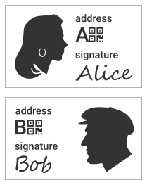
# 市场的手数是1 DCR。
# 订单的所有后备资金都是单个UTXO的形式。
# 没有费用。

这些例子涉及名为Alice的参与者，他持有一些DCR，并希望将其换成一些BTC。市场是DCR / BTC市场，其中DCR是“基础资产”而BTC是“报价资产”。订单数量以DCR为单位，限价订单中提供的费率以BTC计价。

===案例A：完美匹配===

在最基本的情况下，Alice和名为Bob的交易员是唯一的参与者，他们的订单完全匹配。

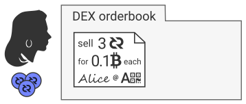
'''A1: Alice开启限价单，以每DCR 0.1 BTC的价格出售3 DCR，共计0.3 BTC。作为限价订单，Alice必须同时指定数量和价格，以及她的BTC地址。Alice签署订单信息。签名提供订单证明，并证明如果她没有通过交易，将对Alice施加任何处罚。

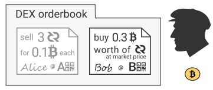
'''A2''':在后来的一些时代，Bob下了一个市价订单，以最优惠的价格购买带有BTC的DCR。鲍勃的订单将包含地址和签名。作为市场订单，鲍勃的订单必须在这个时代匹配。任何未填充的部分会立即取消。

'''A3''': 在epoch结束时，DEX执行匹配循环，识别匹配，并通知Alice和Bob已发生匹配。由于订单数量相同，因此只需从订单中删除订单并将其留作监控。DEX通知两个客户端已进行匹配并向Bob提供Alice的地址。

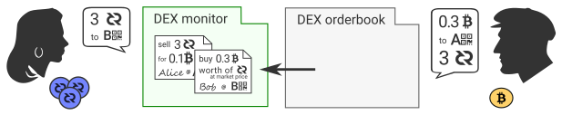

'''A4''': 因为Alice是制作者，所以她将首先播放她的初始化事务。她将在指定的时间内向DEX广播并报告她的交易。
在Alice准备初始化事务之前，她必须生成一个只为自己知道的密钥。从密钥中，Alice生成一个“锁”并构造一个输出脚本，这样如果有人可以提供Alice的密钥和Bob的指定地址的pubkey，他们就可以花费输出。在实践中，密钥只是一个随机的32字节数字，锁是其哈希值。

此外，Alice使用第二个替代锁来构造输出脚本，该锁允许她自己花费输出，但前提是输出在指定的时间内仍未使用。Alice将时间锁定为48小时。

Alice将她的初始化事务广播到Decred网络。她告知DEX交易细节，DEX转发给Bob。Alice没有透露她创造的钥匙。

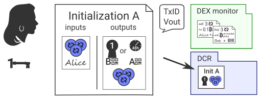

'''A5: Bob检查Alice的交易并检索锁。 在必要数量的确认之后，Bob准备他的初始化事务。他也在这里使用Alice的锁，并创建一个 由Alice的密钥和Alice的地址的pubkey满足的输出脚本。

鲍勃将时间锁定为24小时。Bob还应该检查Alice初始化中的时间锁是否设置为48小时。如果Alice的时间锁定持续时间设置在Bob的时间锁定持续时间附近或之下，则Alice可能会在Bob之前花费DCR输出。

Bob将他的初始化事务广播到比特币网络。他通知DEX交易细节，并且DEX将信息转发给Alice。

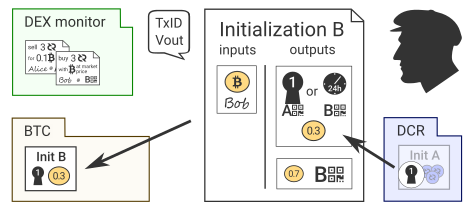

'''A6: Alice准备一个兑换事务，该事务将Bob的初始化事务的输出花费在她自己的地址上。为了从Bob的交易中消费比特币，她需要提供在步骤4中创建的密钥。

Alice将她的兑换交易广播到比特币网络。虽然DEX和Bob都能够监控交易，但是无论如何，预计Alice会向DEX服务器通知交易细节。DEX服务器将通知Bob详细信息。

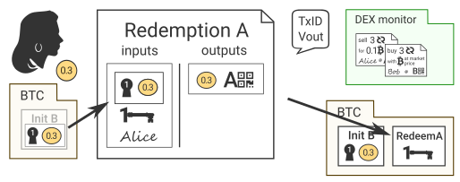

'''A7: Bob使用从Alice的兑换事务中收集的密钥和Alice的初始化事务的输出来准备他的兑换事务。

Bob将他的兑换事务广播到Decred网络，完成 原子交换。

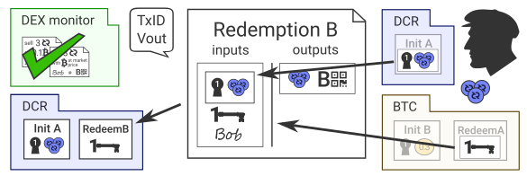

===案例B：具有部分填充的多接收者===

在案例B中，Alice同样试图以0.3 BTC的价格出售3个DCR，但这次DEX发现的匹配并不完美。

'''B1''': 与A1相同。Alice将签署的订单提交给DEX。

'''B2''': Bob以市场价格下达价值0.1 BTC的DCR的市价单。新客户Carl为0.1 BTC的DCR下了相同的市场订单。

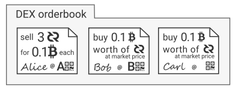

'''B3''': TDEX找到匹配并通知各方，向Alice提供Bob和Carl的地址。DEX不能简单地删除Alice的订单，因为它只是部分填充。在这种情况下，DEX不会从订单簿中删除订单，而只是将其标记为部分填充并计算剩余数量。订单将返回订单簿，并立即再次匹配。

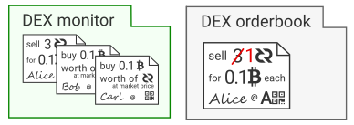

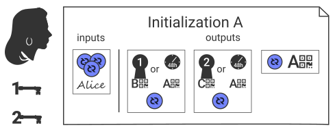
'''B4''': 作为制造商，爱丽丝再次抢先一步。她将她的比赛从时代分组并创建了两个不同的键，一个用于Bob，一个用于Carl。她将时间锁定为48小时。 Alice将她的初始化事务广播到Decred网络，并通知DEX有关交易详情，DEX转发给Bob和Carl。

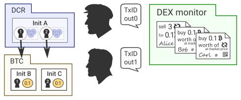
'''B5''' 在等待必要数量的确认之后，Bob和Carl使用Alice的交易中的锁来准备他们的初始化事务。他们广播他们的交易。

'''B6 and B7''' 自然地遵循案例A，其中Alice创建了两个兑换交易，一个用于Bob，一个用于Carl。鲍勃和卡尔然后跟进他们自己的赎回。

==社区行为==

通过注册，客户同意遵守此处描述的规则。这些规则旨在确保客户真诚地行事并保持有助于为人类提供顺畅的DEX体验的行为。

===社区行为规则===

====规则1：每笔交易必须完全解决====

必须在正确的时间创建交换事务（请参阅 广播超时）。

如果制造商未能通过其初始化事务启动原子交换过程，则接收者将被告知由于接受者未能接受订单而终止订单执行。制造商的限价订单不会返回订单簿，但可以选择更换订单。

如果接受者未能回应制造商的初始化交易，制造商将不会发生违规行为。

====规则2：帐户的取消比率必须低于阈值====

取消比率是取消订单数量与已完成订单数量的比率。取消阈值由DEX操作员设置。当所有比赛完全结算时，认为订单已完成。当取消订单与常设限价订单匹配时，订单被视为已取消。如果客户端的连接断开且客户端无法重新连接超过1个纪元的持续时间，服务器也可能取消订单。取消部分填写的订单将被视为完全取消。取消比率在25阶滚动窗口上评估。

====规则3：交易输出必须适当调整大小====

交换输出值的大小必须与匹配的数量完全相同。费率必须至少是DEX设定的最低值。客户有责任确保部分填充的费用不会被超额支付到导致违反规则1或3时剩余部分匹配的水平。

===处罚===

违反行为的主要处罚是禁令，其中包括丧失交易特权，没收注册费以及立即撤销任何未填写的订单。

对于轻微的，第一次或不经常的违反行为，可以考虑不那么激烈的惩罚性措施，例如冷静期。

==数据API==

交易历史记录将同时提供给websocket和HTTP客户端。

==交换管理==

DEX的运作需要非常少量的行政人员。客户将期望近乎完美的正常运行时间和长期运营。

运营商必须妥善管理交易所设置，以保持市场流动性并平衡费用和结算速度。也就是说，交易所或资产变量的变化通常会导致市场上所有现有订单的撤销，因此应尽可能不频繁地进行。

'''交换变量'''

{|
! 变量 !! 相关部分 !! 单位 || 默认
|-
| epoch&nbsp;duration || [[#Epochbased_Order_Matching|Epoch-based Order Matching]] || seconds || 60
|-
| market&nbsp;buy&nbsp;buffer || [[#Market_Buy_Orders|Market Buy Orders]] || unitless ratio || 1.25
|-
| registration&nbsp;fees || [[#Fees|Fees]] || atoms || 1e8 (1 DCR)
|-
| cancellation&nbsp;threshold || [[Rule_2_An_accounts_cancellation_ratio_must_remain_below_the_threshold|Rule 2]] || unitless ratio || 0.6
|}

'''每个资产变量'''

{|
! 变量 !! 单位 !! 描述
|-
| lot&nbsp;size  || atoms ||  The minimum order quantity and the order quantity increment when an asset is the base asset.
|-
| rate&nbsp;step || atoms || The minimum price rate and the price rate increment when an asset is the quote asset.
|-
| fee&nbsp;rate  || atoms/byte || The minimum fee rate for swap transactions.
|-
| utxo&nbsp;confirmations|| count || The Minimum confirmations for backing UTXOs
|-
| swap&nbsp;confirmations|| count || The Minimum confirmations before acting on a swap transaction
|}

另请参见[[#Exchange_变量|Exchange 变量]]。

...

==参考==

&#91;1&#93; Teall, John L., Financial Trading and Investing, p. 336 (2013)

&#91;2&#93; [https://www.sec.gov/comments/sr-nysearca-2019-01/srnysearca201901-5164833-183434.pdf Bitwise Presentation to the U.S. Securities and Exchange Commission] (2019)

&#91;3&#93; [https://github.com/decred/atomicswap Atomic Swaps]

&#91;4&#93; [https://tools.ietf.org/html/rfc6455 The WebSocket Protocol]

&#91;5&#93; [https://tools.ietf.org/html/rfc8446 Transport Layer Security 1.3]

&#91;6&#93; [https://www.jsonrpc.org/specification JSON-RPC 2.0 Specification]

[https://github.com/decred/dcrdex/blob/master/README.mediawiki#table-of-contents 原文请访问]
