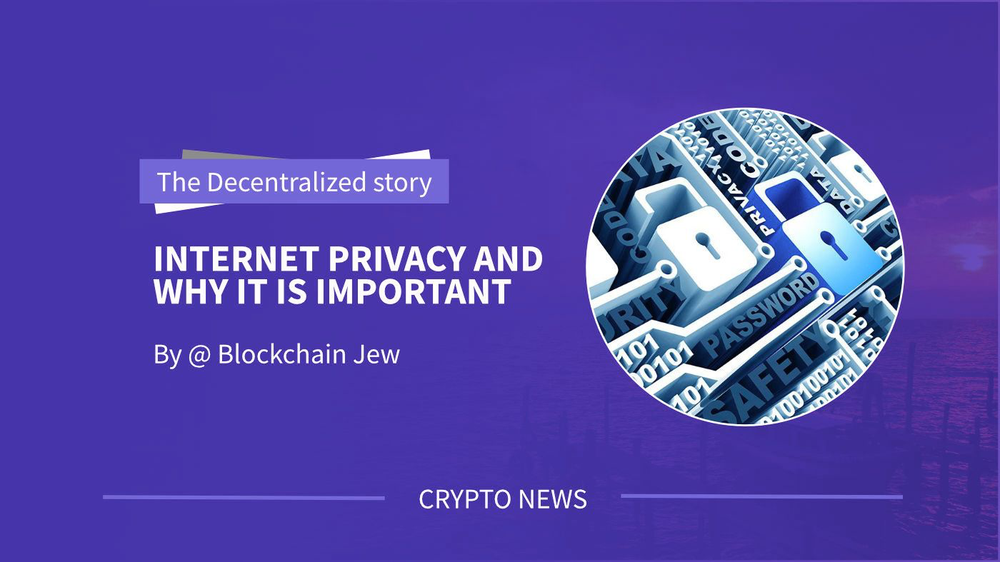
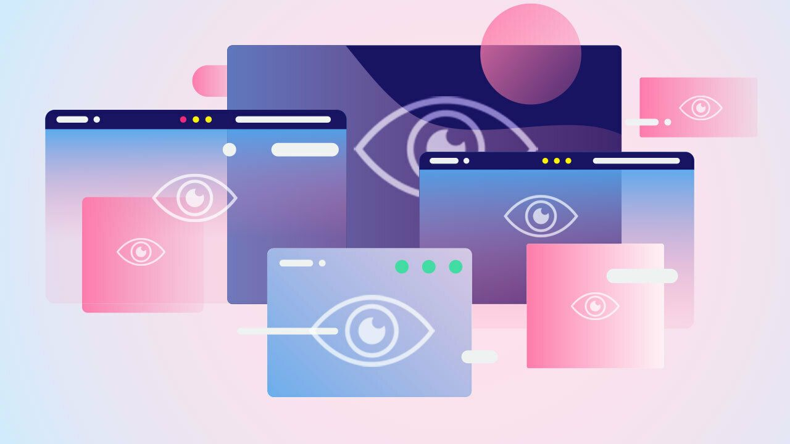

## 互联网隐私及其重要性

作者 @Blockchain Jew

> 伴随互联网的发展，越来越多的用户对隐私的渴望只会增加。隐私是人权，你需要为之奋斗。

隐私是一项基本人权，每个人都应该默认享有，因为它允许他们拥有自己的数据并决定何时共享以及与谁共享。尽管这是世俗科技公司的常识，但考虑到从用户那里窃取的数据越多，这些公司就可以更好地为用户提供相关广告，并且他们在竞争中的地位也越强，因此会被忽视。随着越来越多的最终用户意识到将个人信息出租给所谓的“可信第三方”(TTP) 所带来的风险，他们倾向于采取措施保护他们的隐私并改善数字安全。用户必须深入了解隐私并了解如何保护他们的数字身份。

## What is Internet Privacy?

Internet privacy (also called online privacy) is a subset of data privacy that refers to the control an end-user has (or should have) over the flow of personal information on the internet. In context, Internet privacy is a fundamental human right that end-users are entitled to whenever they display, store or provide information regarding themselves on the internet.

Why is Internet Privacy important?
Many internet users are unaware of the battle they’re up against when taking control of their personal information. What they don’t know is that there are companies dedicated to the cause of siphoning data from users over the internet, they create sophisticated software and bots that track users' activities on the internet in real-time. Privacy on the internet is becoming more difficult as every company is striving to beat the competition, and in a digital economy where data is king, these companies are left with no choice but to pierce through the veil of privacy. Therefore, internet privacy is critical in this digital age as data ownership is becoming a thug-of-war. As our activities on the internet constantly increase, important knowledge and actions on privacy need to be implemented.

Common privacy mistakes made by internet users
Allowing default privacy settings: Usually, when you install a new app on your device, it is given some default permissions automatically. Some of which may include access to Contact, Messages, Location etc. For instance, ad personalization is automatically enabled for most apps (and websites). You can always configure these permissions from your mobile device or browser, but most users neglect this, thereby exposing themselves.

Disclosing too much on social media: Truth is, social media companies are among the biggest data harvesters online. They siphon more data than you think. However, they also hold personal details that users consciously gave to them. These may include (real) name, age, location, activities etc. Sharing less information on social media aids in reducing your digital footprint. A social tool like Bison Relay saves you the burden of sharing too much information online.

Insufficient knowledge about privacy regulations: Many users are ignorant of their privacy rights. The fact is, you can ask companies to provide the data they’ve collected from you and even demand that they delete your data from their database. Unfortunately, not every internet user is aware of the rights given to them by GDPR and other privacy legislation. Though the laws differ in each country, users should ensure that they acquire prior knowledge of their privacy rights and utilize it to the fullest.

Undervaluing your data: Earlier we stated that in a digital economy, data is king. This means that with the right set of data, e-businesses and companies can stand a better chance against their competitors and maximize profit. One of the biggest mistakes internet users make is assuming that their data isn’t relevant, especially if they aren’t highly profiled individuals. While this is a reasonable excuse, the fact remains that every slice of data is valuable. Hackers swamp the internet looking for ways to hijack users' data and sell on the dark web. Likewise, legitimate companies take extensive strategies to collect users’ data. Therefore, users should take the necessary steps to protect their data.

How to protect your privacy on the internet
Use a private search engine: This would probably be difficult for most users, seeing that Google is the go-to search engine. The query you provide a search engine tells a lot about you and provides sufficient data to the search engine provider, using a more privacy-centric search engine like DuckDuckGo would reduce your digital footprint. DuckDuckGo uses Bing results on the back end, also, Bing integrates AI into its service, so you should expect to get a better experience using it. Other private search engines include Hulbee, Startpage, Qwant and Searx.

Migrate to more private social messengers: Bison Relay is Decred’s private social platform that gratifies users’ privacy and data ownership while allowing for content monetization. Unlike regular messaging apps, you can use Bison Relay without necessarily having an account. Bison Relay protects you from irking ads, censorship, data breaches or siphoning.

Use private browsers: Google Chrome is a popular internet browser that serves just right, but if you’re looking to maximize your internet privacy and erase your digital footprints, then opting for a private browser should be the right choice. Brave is an excellent alternative, plus, it offers a similar UI to that of Chrome. Other private browsers include Firefox, Ungoogled Chromium, Tor Browser etc.

Use a secure Virtual Private Network: Using a VPN is the best way to protect your internet privacy as it assigns you a new and secure IP address and protects your online traffic with military-grade encryption. When it comes to selecting the right VPN to use, you should do your research as you would need to trust a third party to secure your network.

Stay informed: Information is an invaluable asset in this digital age, as the internet evolves, users must gain the right information on securing their internet privacy. A good start is joining privacy-loving communities like Techlore’s Discord. To learn more about going private, check out Seth’s article on A Step-by-Step Guide Guide to Going Private.

Privacy is normal
It’s up to users to perform due diligence in owning their data and protecting their privacy. As the internet evolves, the desire for privacy is only going to increase as more users become informed. Privacy is your human right and you need to fight for it.

This article is a sequel to the Twitter space hosted by Tivra on "Privacy Tools for a Sovereign Age".
