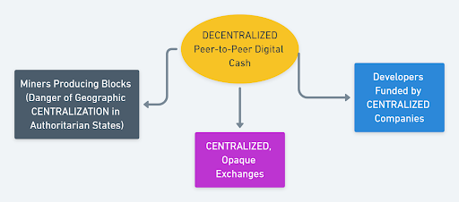
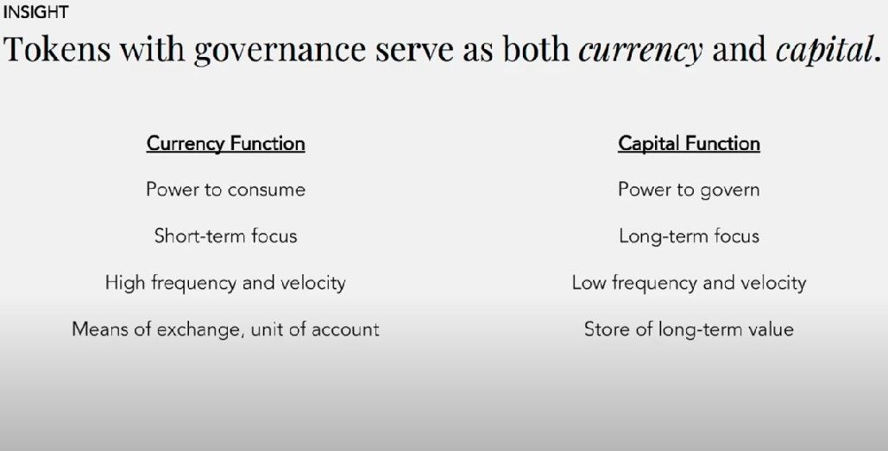

# 点对点生态系统

作者 @Tivra

### 早期的互联网十分神奇：出现了超越民族国家边界的全球分散社会的可能性，人们在其之中自由共享数据。

在当时，这是技术专家和学术界的领地。直到 1990 年代初期所谓的永恒九月，历史将它推向了主流，并且正如新技术诞生那样，导致了互联网泡沫，Web 2.0 就是从中诞生的：今天的 Facebook、谷歌等数字新封建主义和硅谷科技巨头。

随后出现的去中心化和点对点加密与比特币一起出现，并通过一系列泡沫和 2017 年的狂暴牛将其从边缘推向主流，在许多方面让人想起互联网的早期阶段。

比特币本质上是一种流氓货币工具，一个不受监管的资本流动通道，一种在传统和遗留框架和结构的管辖范围之外进行在线商业的手段（因此，在精神上非常自由，与整个90年代和新世纪初期的密码朋克和黑客思想产生共鸣）。比特币本身更像是一种特别的启发式或非常聪明的黑客攻击，它复制了一些经济原理，人为地创造了数字稀缺性和参与者激励的博弈论一致性。

在概念、基本假设甚至美学上与新反动运动和 Urbit 项目有些相似，比特币同样以其功能保守简单性脱颖而出。

所有这些可能都是必要的手段，以证明在没有任何管理控制中心点（因此也没有失败）或直接人为干预的情况下，将现实世界的价值注入到去中心化网络中流通的技术可能性。

这种媒介应该能够及时大幅提高配置资本的效率和精确度。比特币确实选择了正确的时机出现，并在 2008 年经济危机之后乘势而上。当我们进入另一场经济危机时，是时候再次

### 反思那件事了。

此后，这一事件引发了很多关于如何充分建模和设计有效的自我调节市场（或重新发现“看不见的手”）的理论。正如 2008 年所揭示的那样，金融资本主义已经达到了抽象复杂的程度，可能会失控，并且我们能够有效地管理这种组织的复杂性（一直在应用关于市场的信念和公理，这些信念和公理不再适用并且似乎更多地植根于意识形态而不是理论上基于任何参考点到运动中的现实） .

## 重新想象金钱

_OpenAI 生成的“凤凰从燃烧的银行灰烬中升起”_

让我们稍微回顾一下：钱是什么？

一个简单的答案是将自由浮动的抽象债务为事物之间的普遍等价衡量标准，这样它就可以在陌生人之间进行商品交易，否则他们既不认识也不信任对方。交易的东西之一也是劳动力，因此货币也具有分配生产性工作的功能。另一方面，价格充当沟通供求关系的信息系统：什么供过于求，什么需要更多生产。因此，通过信息论（在哈耶克著作中发展起来的一种思路）的视角可以更好地理解货币。

然而，当金本位在 70 年代初期被放弃时，这种债务体现在对美国经济的信任中（因此，法定货币，就这样吧）—— 这反过来又赋予了国家直接产生这种抽象债务的权力按下按钮，没有任何理由或支持它。那样的话，基本上就是从未来借钱，押注在那个阴暗、不确定的未来的某个时候偿还那笔债务。这反过来又创造了一个过度活跃的社会，为了在未来偿还过去的债务，社会必须不断扩张。

## 比特币面临的挑战

比特币 —— 具有固定、可预测供应的点对点现金，但并不真的具备可互换性，因为分类账保留硬币的防篡改审计跟踪 —— 使得将一些硬币列入黑名单成为可能，而且通常旧硬币可信度超过新铸造的。（因此，比特币极简主义模因“1 BTC = 1 BTC”从字面上看并不正确。）

然而，与法定电子货币不同的是，如果大规模采用，比特币将存在可扩展性问题——更不用说过去在某些专制司法管辖区中持续出现的挖矿集中化威胁（因此，它也具有地缘政治成分）。

一些加密货币的出现是为了尝试迭代比特币的总体思想，解决它的一些缺点：例如， Monero是匿名的、不可追踪的和抗ASIC。

总的来说，在比特币之后发展起来的企业或项目大多是（并且仍然是）推进和重新利用共识驱动区块链的一般概念（例如，以太坊为其配备代码执行环境以运行存储的更复杂的操作在区块链本身的代码中，等等）

迭代比特币的尝试可以分为许多类别，例如：

- 隐私：Monero、Decred、ZCash 等 - 涉及复杂的加密协议，这些协议本质上是最“cypherpunk”的。
- 可扩展性：Mimblewimble（例如 Grin、BEAM）和闪电网络
- PoW 挖矿中心化和垄断形成带来的预防威胁：Monero（具有抗 ASIC 的 RandomX）、Decred 的混合 PoW/PoS 是对抗矿工中心化的不同方法（尤其是最近提高奖励率的举措）

这些都是具体的改进领域 —— 但还有更全面、更系统的问题困扰着比特币，而这些问题往往被比特币社区所忽视。比特币最初被设想为一个完全去中心化的系统，但它已经存在并在一个由中心化和孤立的实体和服务组成的生态系统中运行，因此，它构成了重新中心化和被捕获的威胁。Decred 本身在另一个方向上采用了比特币的一般前提，它构成了利益相关者的 DAO，利益相关者拥有系统中的股份（因此，直接激励通过增加保护它的系统的价值来增加它们的价值）。Decred 旨在通过调整网络参与者和参与者的激励和利益来减少或消除利益冲突和硬分叉。Decred 将治理的主要方面直接纳入协议，非常注重社区投入以及可持续的资金以及未来发展。

## 去中心化整个生态系统

> “我很想说 decred 是最好的比特币” - Chris DeRose

比特币存在于一个重叠和交织的再中心化趋势的生态系统中，其治理和发展轨迹由 Blockstream 等传统公司结构驱动。实际上，比特币主要是通过托管经纪人和中心化交易所购买和交易的，这需要个人身份验证并通过 KYC/AML 程序。这本身在很多方面都违背了比特币本应实现的目的（因为在中心化交易所交易去中心化资产毫无意义，除非以其传统形式模拟市场动态）。不要忽视或削弱比特币在将分布式点对点去中心化范例从边缘拉入主流方面所做的贡献，而是询问比特币是否可以根据其早期的精神变得更像比特币。

以下是生态系统如何以其当前类似联盟的形式运作的简要概述：

如果中心化实体可以被去中心化实体取代会怎样？去中心化资产在去中心化生态系统中流通，该生态系统由松散耦合的独立子系统组成，可抵抗攻击，从而保护其免受重新中心化的影响。

.png)

这就是 Decred，在加密领域持续为这一目标前进。可以打个比方，有许多基于 Linux 内核的不同发行版，Linux 内核本身是免费的，但被专有软件包围，而 Decred 更像是一个 BSD 系统，其中内核、发行版和所有软件包作为一个整体存在并且是免费软件。

正是在这种权力下放的情况下，以及系统中各部分之间关系的灵活特性，为创新创造了条件。Decred 是一项推动整个“操作系统”的替代方案的事业，它在复杂的适应性系统上建立了更具弹性和稳健性的东西。

## 从加密货币到加密资本

我们应该要么在不断受到捕获威胁的中心化实体生态系统中接受比特币，要么以另一种方式进一步推动加密领域发展，以尝试去中心化整个生态系统，努力成为不同类型的市场经济。雄心勃勃，甚至可能宏大，但考虑到目前的事态，绝对有必要。

我们将 Decred 视为一种组织形式，或者在该领域更广为人知的一种去中心化自治组织 (DAO) —— 一种电子点对点生态系统（代替中本聪的“点对点电子现金” ).

左翼批评资本主义，提醒我们注意当今社会存在的不平等是恰当的，尽管他们的解决方案，从国家资本主义的中央计划经济到如今更加不真实的流氓左翼大喊“吃掉富人！”。 就我们面临的这些问题的现实而言，这些确实产生了很多共鸣，但解决方案必须是普及资本的巨大生产潜力并将其生产能力用于社会公益。

在 Decred 的数字经济愿景中，用户、工人和客户共同受益于网络本身积累的价值增长，因为货币和资本的功能结合在一起工作（而不是将价格与价值分开）。当今社会的大部分不满都与无法获得生产资料以及因不直接参与价值创造（但不得不出卖自己的劳动力）而产生的异化有关。

我们通常将公司与肆无忌惮的牟取暴利联系在一起，并将其视为恶性甚至邪恶的事物，而忽视了其作为一般组织概念存在的理由。与任何技术革命一样，工业革命改变了劳动力的组织方式，从而极大地提高了生产力。同样，今天的技术革命使旧概念在新环境中的功能再利用（或“去域化”）成为可能，通常会导致它们在本质上发生变化。

但工业革命中真正的“革命”是什么？这是一个神奇的时刻，英国政府决定将二级主权授予公司，并创建一个法律实体，一群人可以联合起来，在法律结构内拥有共同资本和为它工作的人。在此之前，人们基本上仅限于可以相互信任的小群体。现在突然间出现了一个可以将人和资本与每个人的激励都一致的激励结构粘合在一起的实体。

因此，英国政府的这项创新促成了令人难以置信的繁荣，不仅带来了发明，还让它们变得伟大，并将它们交到人们手中。人们仍然低估了它的价值。工业时代最重要的“发明”不是任何具体的技术发明，而是加速所有其它发明的“元发明”；这也可以称为激励对齐，这似乎是 Decred 做一直在做的事情。 在工业革命中产生巨大进步的是一种激励机制，它让原本不信任彼此的人们为了同一个目标而共同努力. 然而，Decred 以去中心化的方式而不是通过国家强加的虚拟人物来做到这一点，这一点至关重要。

我们感觉这些被称为公司的实体，由于其获得的法人实体地位，已经开始成为推动历史前进的主要“主体”。就好像他们有自己的智慧和代理机构。人工智能领域的先驱之一 Stuart J. Russel 教授最近甚至将公司描述为已经接管的人工智能。

> “[...]我们不必期待 AI 系统接管世界的时代：他们已经拥有并且被称为公司. 公司现在恰好将人用作组件，但它们实际上是算法机器，它们优化的目标是季度利润，与人类的整体福祉不一致 [...] 这是一种方式考虑我们公司正在发生的事情，但我认为 [...] 在现实世界中有许多系统，我们有点过早地固定在目标上，然后将机器与他们应该做的事情脱钩服务，我想你在政府身上看到了这一点。政府本应是为人民服务的机器，但它往往被有自己目标的人接管，并利用政府来优化该目标，而不管人们想要什么。” （Stuart J. Russell 教授，

Stuart J. Russell 教授在运行的“算法机器”的类比来指出他认为政府-公司联合体存在的两个问题：

1. 过早确定目标（季度利润）；

2. “机器”与它原本要服务的对象“脱钩”。

由于公司存在于政府提供的法律框架内。公司必须优化其目标，有时这会导致利用环境“故障”的行为（利用税收漏洞等）。以这种看待事物的方式，我们消除了任何道德语言（“腐败，邪恶”...)，并以纯粹系统的方式看待偏差：我们认识到同一组问题，但我们在实际开发替代方案来解决这些问题方面更有优势。道德主义是无效的，应该被系统思维所取代。“不作恶”应改为“不能作恶”。

我们应该将公司视为向前迈出的一步，从一群相互信任并基于信任共同经营业务的亲密朋友，到可以更好地扩展的事物。这样的团体或家庭当然可以在无需使用任何特殊组织的情况下进行协作，但这种模式无法扩展。为了扩展，我们需要类似公司实体的东西。没有它，陌生人就无法合作，资本与劳动力就无法加速进步。

传统公司的问题不在于我们假设会在哪里找到它。这并不是说需要更多的监管。正是这些法规加速了问题的发生，因为这些“人工智能”公司学会了规避它们，而普通人却无力这样做。“点对点等公司”能够做的，是规避国家和公司之间的这种二元性，并创建一个赋予利益相关者直接权力（而非委托）的实体。用户也可以是利益相关者，也可以是匿名的全球“董事会”的成员。在传统的公司架构中，这些方面的割裂导致了用户想要什么、股东想要什么以及董事会想要什么之间的鸿沟。

## 统一货币和资本

个人回忆：我记得当时在一个小公司上班的时候我不太喜欢，但我非常希望公司有足够的业务不倒闭。如果生意太多，我就得加班，但工资是一样的。如果它太少，它可能会面临倒闭的风险，我就会失去工作。如果我获得公司的股份，我的感受会不会有所不同？

错位的（或不正当的）激励机制以及工人劳动价值得以估价和交换的量化媒介导致了马克思所说的异化。但是，如果货币和资本作为直接参与（在某些此类数字合作公司中）工作及其成果和结果的工具，那么这将更好地激发动机并在心理上促成不同模式的连贯经济行为。

当我读到 Placeholder VC 的 Joel Monegro 的评论时，我首先清楚了实现这种新型组织的关键及其意义，这是一个名副其实的灵光一现的时刻（链接到他的想法的视频演示）：加密治理允许对于不仅仅是“货币”的东西的出现：它允许加密资本的出现。什么是资本？简而言之，资本是有效组织劳动力和调动生产资料以实现预期结果的力量。

> “将货币和资本分开会导致集中。现代资本主义将货币和资本分开。资本会随着时间的推移而升值，而货币会随着时间的推移而贬值，从而导致财富和权力的大规模集中。” （乔尔·莫内格罗，14:15）

Decred 之类的东西使上述正式激励调整的“超级大国”成为可能，但不必存在于依赖广泛的官僚机构和专门的人类专业知识来运行在它的法律框架内（因此，繁琐，通常效率低下并且容易受到外部影响、游说、人为错误和偏见的影响）。

仅从“腐败的个人”和“坏苹果”的角度来看待当前经济被操纵的游戏情况是天真的——相反，更仔细地研究制约和构成这种事态的系统性原因。根据定义，一家公司致力于优化其“奖励功能”，这通常根据季度利润来定义——因此，它必须使用所有可用的手段来实现这一目标。所以，利用游说、各种逃税方式等，才是合理的。

在 Decred 中，货币（作为记账单位和交换手段）和资本（作为有效组织劳动力的能力）的功能结合在一起- 例如，为 Decred 生态系统工作的人员以系统的原生代币支付报酬，该代币也用作投票，允许持有者参与为未来发展设定方向的决策过程。从而让利益相关者直接对他们的选择、决定和行动的结果负责，而不是将这些责任委托给中央银行、政府机构或一些狭隘的专家小组（他们的利益可能并不总是与他们预期的人的利益一致）代表他们的利益并为他们的利益行事，他们往往不承担他们可能承担的各种风险的负担）。

虽然同意左翼对现代金融资本主义及其造成的不成比例不对称的批评，但解决方案可能在于价格与价值、货币与资本的耦合，而不是更严格、更严厉的监管、繁琐的官僚机构，并增加国家干预。

> “大多数人生活在货币中，很少有人生活在首都。货币往往会随着时间贬值，而资本往往会随着时间升值。” (15:00)

在撰写本文时，我们正在目睹社会前所未有的分裂。这种分裂通常被描述为左派和右派、有产者和无产者、社会主义者和资本家之间的分歧。但这场战斗是在创造它的系统之内进行的，而不是在它之外。这个系统，不会被无政府状态或愤怒所克服，而是被与公司一样有效、有生产力（如果不是更多）但没有僵局的东西所克服。在我看来，将货币与资本、股份与工资、参与游戏与主权结合起来的想法朝着双方都满意的方向迈进，并创建了一个可以跨境合作的自我导向、自治的集体。

现在试着想象一个社会如何在这个“操作系统”而不是社团主义的操作系统上运行。我被这个愿景所吸引。
