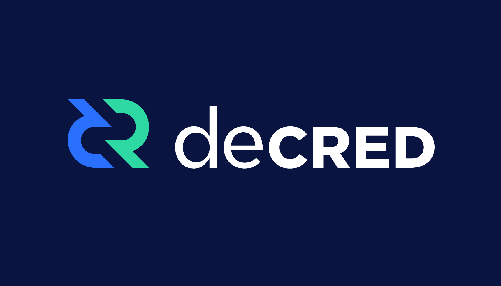

# 选择的悖论：在图灵完备和非图灵完备区块链之间做出选择

作者：Blockchain Jew

> 图灵完备区块链的优势和魅力在于其可编程的多功能性，但同时也存在着它的弱点。

区块链是分布式账本，用于存储和维护有序交易记录列表，称为块。为了维护这些记录，区块链使用一种称为共识机制的系统，它涉及网络参与者挖掘（工作证明）或抵押他们的硬币（股权证明）。除了存储和提供数据外，区块链还托管一系列可执行代码，称为“智能合约”，这些代码是在满足特定条件时执行的程序。每个区块链的智能合约能力根据其图灵结构而不同（即，它是图灵完备的还是非图灵完备的）。在本文中，我们将深入研究图灵完备和非图灵完备的区块链。

## 让我们从基础开始

为了有效地理解图灵完备（和非图灵完备）的概念，我们需要参考Alan Mathison 的图灵机。1936 年，艾伦·M·图灵 (Alan M. Turing) 假设图灵机是一种抽象的数学工具，只要给它足够的时间和必要的指令，它就可以执行任何计算机算法（无论其难度如何）。

需要明确的是，图灵机不是一个物理项目，而是一个理想化的数学模型（它催生了“图灵完备”一词）。艾伦设想机器有无限长的磁带，分成盒子，每个盒子都有一条用二进制代码（1 和 0）编写的指令，机器可以解释这些指令。每次向机器发送指令时，它都会通过在同一个框中用新符号覆盖旧符号来执行命令。然后更新机器的状态。图灵机理论为现代计算机和编程语言（如 Python、Java、C++、Ruby 等）设定了标准

在上下文中，当系统可以解决或执行任何计算问题或指令时，它就是图灵完备的。另一方面，非图灵系统将是功能有限且只能解决基本问题的系统。为了更好地理解对比，将袖珍计算器视为非图灵完备机器，因为它仅限于解决一组有限的数学问题。但是，您的智能手机可以被标记为图灵完备机器，因为它能够执行与计算器相同的任务，包括更复杂的任务。然而，重要的是要记住，袖珍计算器在设计时只考虑了一个功能，这使其成为比智能手机更可靠、更有效的选择，智能手机可能会死机、显示令人讨厌的广告或出现错误。

## 图灵完备区块链

关于区块链技术，当区块链建立在允许开发人员部署复杂的智能合约和去中心化应用程序 (dapps) 的编程语言之上时，它被认为是图灵完备的。以太坊是图灵完备区块链的完美示例，其智能合约是用图灵完备编程语言Solidity编写的。此外，以太坊的智能合约是在 EVM 上执行的，EVM 是一个图灵完备的机器，它是以太坊区块链上运行的所有智能合约的总监督者。图灵完备仅仅意味着开发人员可以探索编写和部署复杂智能合约的可能结果，这是我们今天所知道的去中心化金融 (DeFi) 的基础之一。

图灵完备区块链的优势和魅力在于其可编程的多功能性，但同时也存在着它的弱点。部署在图灵完备公共区块链上的智能合约有时难以审计，如果不法分子较早发现错误，则可能会被利用，从而导致合约黑客攻击和流动性虹吸。在发生的众多黑客事件中，最重要的是TheDAO，这是 2016 年在以太坊上构建的一个智能合约，用作筹款平台。该团队未能观察到代码中的弱点，并被黑客利用较早发现它，导致投资者资金损失超过 5000 万美元。为了解决这个问题，以太坊基金会决定分叉区块链，投资者通过 Withdraw DAO 获得退款。但是 TheDAO 并不是唯一被利用的智能合约；其他遭受黑客攻击但未规定退款投资者的平台已成功地将投资者与他们的资金永远分开。

## 非图灵完备区块链

与图灵完备的区块链不同，它们本质上更简单；这是因为他们只能执行简单的智能合约。比特币是一个非图灵完备的区块链，其智能合约是用Script编程语言编写的。Script 是一种基于堆栈的编程语言，可以创建简单且有条件的智能合约。

尽管无法支持复杂的智能合约，但非图灵区块链的一个显着优点是它们提供了更高的安全性，并且更容易有效地审计代码；这些都是需要考虑的关键因素，尤其是在流动性岌岌可危的情况下。

## Decred 是图灵完备的区块链吗？

Decred 不是图灵完备的区块链，因为它使用称为 txscript 的脚本系统来编写智能合约。Txscript被描述为一种简单的、基于堆栈的、类似于 Forth 的编程语言，可用于指示事务的附加条件。与比特币类似，它也可以实现时间锁定，以防止在首选时间之前花费 $DCR。

作为一种基于堆栈的语言，txscript 使用操作码（opcodes）从堆栈中弹出项目，对其进行计算，并将结果推回堆栈，类似于堆栈数据结构。每个脚本从左到右运行，并且在运行时使用堆栈来存储值。

作为一种非图灵完备的编程语言意味着它缺乏复杂的结构和功能。虽然这可以被认为是一个限制，但它确实带来了关键的好处。其中之一是它对“停止问题”的免疫力——确定程序是运行完成还是停止（即在任何时候终止）的挑战。这是图灵完备的一个常见问题，因为它的复杂性，它变得不确定智能合约是否足够可靠以完全执行或进入无限循环。此外，合约的复杂性是有限的，这使得审计和全面测试变得容易。

## 结论

了解您选择投资或基于您的项目的区块链至关重要。总之，图灵完备表示系统的强度、复杂性和潜在的安全风险。另一方面，非图灵完备系统支持简单性。

