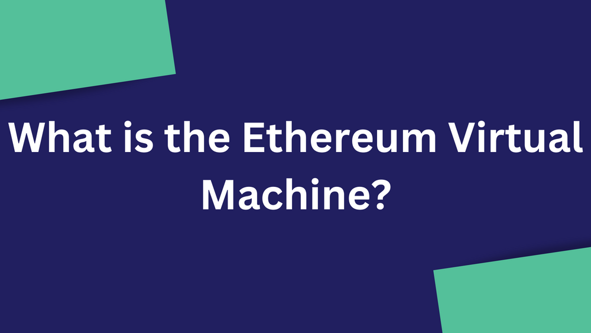
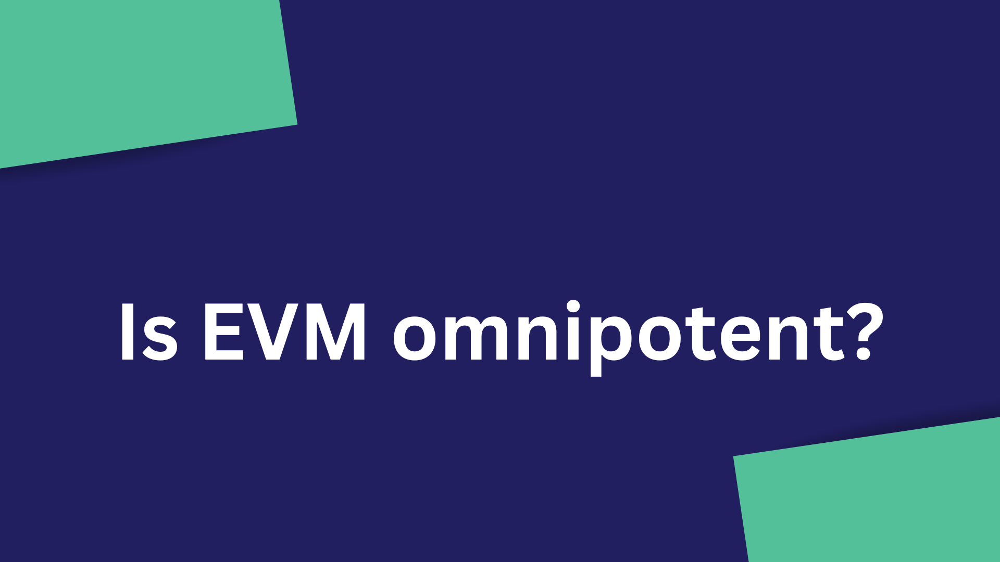
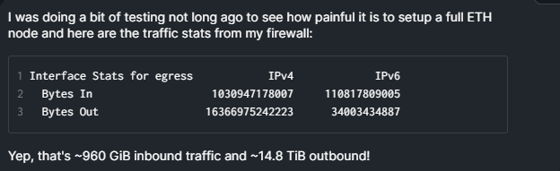

# 为什么 Decred 不兼容 EVM？

作者：BLOCKCHAIN JEW

> EVM（或以太坊虚拟机）是一种虚拟计算机，它创建了一个环境，允许开发人员使用 Solidity 编程语言编写、部署和执行智能合约（和 DApp）。

有超过650 个区块链与 EVM 兼容，但 Decred 不是其中之一。为什么？在本文中，我们将在更深入地了解以太坊虚拟机的同时找到这个问题的答案。

## 什么是以太坊虚拟机？

EVM（或以太坊虚拟机）是一种虚拟计算机，它创建了一个环境，允许开发人员使用Solidity编程语言编写、部署和执行智能合约（和 DApp）。EVM 还负责维护以太坊网络的状态、存储数据和处理交易。

## 以太坊虚拟机的主要特点

图灵完备机：艾伦图灵于 1936 年提出图灵机（也称为自动化机器）作为一种可以使用二进制代码（0 和 1）解决任何计算问题的设备。如果系统或（编程语言）可以使用代码执行或解决任何计算问题，则它被认为是图灵完备的。EVM 通过支持执行各种算法和程序，充当以太坊网络的图灵完备机。

分布式状态机：EVM 被认为是分布式状态机，因为它维护着以太坊区块链的去中心化状态。EVM 负责执行智能合约并根据这些执行的结果更新网络状态，例如执行交易时的钱包余额。

隔离：以太坊虚拟机与网络完全隔离；这允许 EVM 中的智能合约在与主网络分离的环境中运行。在智能合约被黑客攻击的情况下，它不会影响底层协议的其余部分。

Gas 激励：Gas 是执行特定操作所需的计算成本的计量单位。通常，它是由操作的复杂性决定的，例如部署智能合约比将硬币发送到另一个钱包需要更高的 gas 费用。gas 费以 $ETH 或链的原生代币（如果它是 EVM 链）支付。

## 区块链与 EVM 兼容意味着什么？

EVM 兼容性允许区块链运行 EVM 并在其网络上执行以太坊智能合约。对于开发人员而言，这意味着他们可以轻松地跨多个 EVM 兼容链构建和部署 Solidity 智能合约和 DApp，而无需对代码进行任何重大更改。

## 为什么选用EVM？

在此之前，比特币是唯一允许我们在不需要银行的情况下发送和接收数字资产的重要网络。然后是以太坊，它给了我们一些不同的东西：智能合约。智能合约的引入导致开发人员在以太坊区块链上构建有趣的产品，从而吸引用户的流动性。很快，以太坊成为流动性中心，而其他区块链进入这一点的最简单方法是成为 EVM 兼容网络（如果你不能打败他们，就加入他们）。

除了虹吸流动性之外，大多数开发人员发现支持 EVM 兼容链更简单，因为他们可以构建他们所谓的“多链”DApp（这些 DApp 可以轻松迁移到其他 EVM 兼容链）按钮，通过简单地复制和粘贴他们的智能合约代码，使 DApps 的令牌更容易跨多个 EVM 链部署）。

## EVM是万能的吗？

当您考虑与 EVM 兼容的区块链数量时，很容易得出 EVM 是运行网络的最佳选择的结论。相反，EVM 有其自身的问题，不幸的是，一些开发人员选择忽略这些问题。

1. 重入攻击：这是一种当智能合约中存在漏洞时发生的攻击，允许攻击者在前一个调用完全执行之前重复调用合约中的函数。在这种情况下，攻击者可以将资金发送到他的钱包或操纵合约的状态。重入攻击的一个著名例子发生在 2016 年，当时攻击者利用了The DAO 的智能合约。攻击者能够重复调用合约中的一个函数，从智能合约中转移资金，导致超过 6000 万美元的损失。

2.功能有限：考虑到其“CTRL C+V”模型，EVM 智能合约的原生功能有限，迫使开发者构建更复杂的智能合约。构建复杂合约背后的风险在于无法轻易检测到错误，并且由于流动性受到威胁，攻击者可以轻松抢走用户的资金。此外，合同越复杂，其效率就越低。2017 年，基于智能合约的加密钱包Parity wallet遭到黑客攻击，导致价值超过 3000 万美元的以太币损失。虽然 Parity 钱包智能合约因其复杂性而被认为是安全的，但其复杂性导致攻击者利用未检测到的漏洞。

3.过时：自成立以来，EVM 的功能没有发生任何重大变化，这就是它非常有限的原因。当开发人员求助于构建更复杂的合约时，就会引入安全威胁。

尽管 EVM 存在这些缺点，但一些开发人员认为回报（流动性和新用户）值得冒这个风险。

## Decred 支持智能合约吗？

简短的回答是肯定的！与 EVM 兼容链不同，Decred 采用一种简单的、基于堆栈的编程语言，称为txscript。Txscript 是一种图灵不完备的语言，这意味着它缺少一些功能，如循环和其他复杂结构。这使得 Decred 的代码不那么复杂并且可以抵抗停机问题。为了更好地理解这个想法，您可以将它与更简单但功能强大的类似比特币的智能合约联系起来。

# Decred 是否有可能与 EVM 兼容？

需要明确的是，Decred 有可能成为 EVM 兼容链（并支持类似以太坊的智能合约），而无需对其共识规则进行任何严格的修改，使用像 RGB 这样的模型。那么，为什么 Decred 不是一个？

除了与 EVM 兼容带来的安全风险外，运行完整的 ETH 节点可能会占用大量资源（这就是一些 EVM 兼容链决定使用集中式服务来运行节点的原因）。虽然 Decred 从中获得的流动性可能是一个很好的诱惑，但采用容易出错的 VM 将被视为提供全局状态存储的天真方法。

当被问到时，一位社区开发人员不得不说：

> “不支持 EVM 的原因是因为强大的力量伴随着巨大的责任。图灵完备的智能合约为程序员提供了更多搬起石头砸自己脚的方法。当金钱摆在桌面上时，用户和投资者也会被打中脚，因此您可能听说过如此多的智能合约黑客攻击和数百万（数十亿？）美元的损失”。

